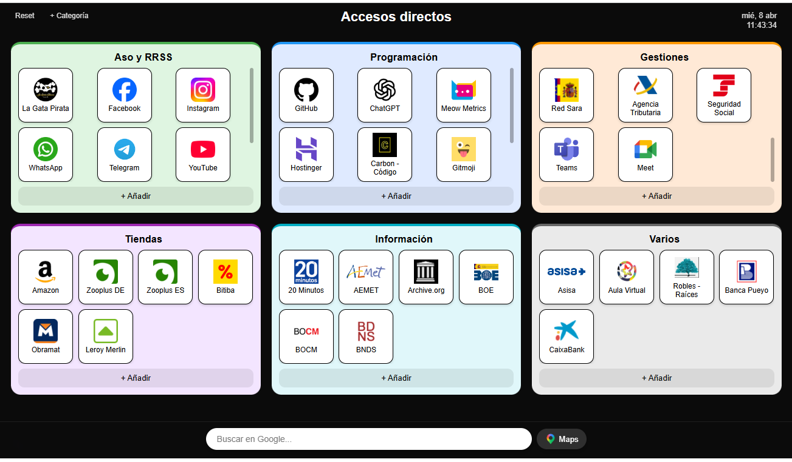

# 🧭 Mi Speed Dial - Página de inicio personalizada

Extensión de navegador tipo speed dial para personalizar la nueva pestaña con accesos directos organizados por categorías.

---

## ✨ Características

- Categorías en formato cards
- Enlaces con icono + texto (se abren en pestaña nueva)
- **Drag & drop rediseñado:**
  - Al arrastrar un icono aparece un círculo verde **+** en la esquina de cada icono destino
  - Soltar sobre el **+** inserta el icono en esa posición
  - Soltar en el área vacía de una tarjeta lo añade al final
  - Soltar fuera de un círculo verde cancela el movimiento
  - Reordenar categorías arrastrando por el título, soltando en cualquier punto de la tarjeta destino (icono, hueco o cabecera)
- Scroll interno por categoría (máx. 3 filas visibles; todas las tarjetas miden lo mismo aunque tengan menos enlaces)
- Añadir enlace con el botón **+** de la esquina superior izquierda de cada tarjeta
- Editar enlaces (clic derecho sobre el icono)
- Crear categorías desde un único formulario (nombre y color a la vez)
- Eliminar categorías con el botón **✕** de la esquina superior derecha de cada tarjeta
- Renombrar categorías con doble clic sobre el título
- El color elegido al crear una categoría tiñe también su fondo (tono pastel automático), no solo el borde
- Sistema de iconos automático:
  - favicon del sitio
  - fallback a Google (`s2/favicons`)
  - icono local por defecto
- Persistencia con `localStorage`
- Exportar todos los enlaces y categorías a un archivo `.json` (botón **💾 Exportar**) e importarlos de vuelta (botón **📂 Importar**), como copia de seguridad independiente del Reset
- Buscador de Google integrado con acceso rápido a Maps
- Reloj en tiempo real
- Barra inferior y reloj fijos, siempre visibles por encima del contenido
- Botones Reset y Categoría con estilo coherente, siempre en primer plano
- Interfaz limpia, rápida y responsive

---

## 📦 Instalación (sin Chrome Web Store)

1. Descargar el proyecto
   👉 Pulsa en **Code → Download ZIP**

2. Descomprimir la carpeta

3. Abrir Chrome y acceder a:
   `chrome://extensions/`

4. Activar **Modo desarrollador** (arriba a la derecha)

5. Pulsar **Cargar descomprimida**

6. Seleccionar la carpeta del proyecto

7. Listo ✔

Al abrir una nueva pestaña, aparecerá la página personalizada.

---

## 📁 Estructura del proyecto

- `index.html` → estructura principal
- `styles.css` → estilos y diseño
- `script.js` → lógica y funcionalidades
- `manifest.json` → configuración de la extensión
- `icons/` → iconos personalizados

---

## 💾 Persistencia de datos

Los enlaces y configuraciones se guardan en el navegador mediante `localStorage`.
Si se pulsa **Reset**, se recuperan los enlaces predeterminados definidos en `script.js`.

---

## 🔄 Historial de cambios

### v1.5
- Botones **💾 Exportar** / **📂 Importar**: guardan todas las categorías y enlaces actuales en un archivo `.json` descargable y permiten recargarlos después, como copia de seguridad manual independiente del botón Reset

### v1.4
- Botón **✕** visible en cada tarjeta para eliminar la categoría (sustituye al atajo oculto de clic derecho sobre el título)
- Crear categoría ahora abre un único formulario con nombre y color a la vez, en vez de dos preguntas seguidas
- El color elegido para una categoría también tiñe su fondo con un tono pastel automático, no solo el borde superior
- Grid interno ampliado a 3 filas de iconos; todas las tarjetas reservan esa altura aunque tengan menos enlaces, para que se vean uniformes
- Botón "+ Añadir enlace" reubicado como icono circular en la esquina superior izquierda de cada tarjeta (ya no ocupa una franja completa)
- Corregido un bug de drag & drop: al arrastrar una categoría por el título, soltarla encima de los iconos de otra tarjeta no funcionaba; ahora se puede soltar en cualquier punto de la tarjeta destino
- Guardar con la tecla Enter en los formularios de enlace y categoría

### v1.3
- Barra de búsqueda y botón Maps fijos en la parte inferior, siempre visibles al hacer scroll
- Fondo sólido con blur en la barra inferior para que no se mezcle con las tarjetas
- Reloj fijo con fondo en pastilla, siempre legible sobre cualquier color
- Botones Reset y Categoría con el mismo estilo y z-index correcto, sin quedar tapados
- Corrección de layout en pantallas/ventanas pequeñas: padding inferior para que los botones de añadir no queden ocultos bajo la barra
- Nuevo enlace predeterminado: Gitmoji (https://gitmoji.dev) en Programación

### v1.2
- Drag & drop completamente rediseñado: zonas de drop visibles en esquina de cada icono
- Corrección del cálculo de posición al mover iconos hacia adelante
- Los enlaces se abren ahora en pestaña nueva (`target="_blank"`)
- Botón de acceso rápido a Google Maps junto al buscador
- Iconos más grandes y mejor aprovechamiento del espacio en cada recuadro
- Mayor margen superior para que los controles no queden cortados
- Soltar fuera de una zona válida ya no mueve el icono accidentalmente
- Nuevos accesos directos añadidos a los predeterminados

### v1.1
- Primera versión funcional como extensión de Chrome
- Drag & drop entre enlaces y categorías
- Sistema de iconos con fallback automático

---

## 👤 Autor

**Verónica Corpa**
Versión: 1.5

---

## 🙌 Agradecimientos

A **Juanma (Animalia Consulting SL)** por la idea inicial y el archivo `manifest.json`, que sirvieron como base para convertir el proyecto en una extensión funcional.

---

## 📌 Estado del proyecto

Proyecto desarrollado como práctica de programación web, con enfoque en usabilidad, manipulación del DOM y personalización de la experiencia de usuario.

---

## 🔧 Posibles mejoras futuras

- Selector manual de iconos (subida o librería)
- Temas (modo claro/oscuro)
- Sincronización entre dispositivos
- Edición directa sin modal
